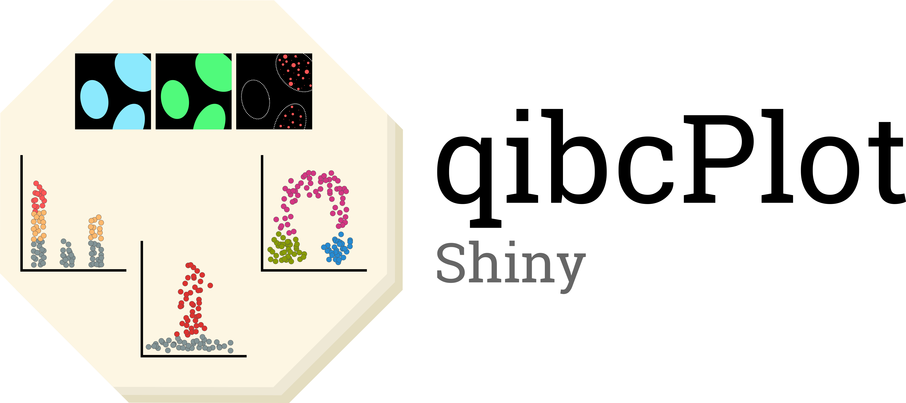

<p align="center">
  
</p>
## What is qibcPlot-shiny?
qibcPlot-shiny is the interactive shiny app for the [qibcPlot repo](https://github.com/callum-jpg/qibcPlot).

This app aims to offer users an easy way of generating 3-variable scatter
plots from CellProfiler output data. More information on using CellProfiler is available [here]()


### What can qibcPlot-shiny do for you?
- 3 Varible scatter plot

### Future features planned for qibcPlot-shiny
- Jitter dot/bar plot
- Cell cycle gating
    - Quantification of marker expression in specific cell sub-populations

## Getting started
Before running the local R Shiny app, Plotly requires some system dependencies:
- Linux
  - libssl-dev
  - libcurl4-openssl-dev

- ```sudo apt-get install libssl-dev libcurl4-openssl-dev```

Once installed, open `qibcPlot-shiny.R` in RStudio and install the required dependencies:
- ```install.packages("ggplot2", "plotly", "shiny", "data.table", "RColorBrewer")```

Next, change the working directory of Rstudio to the location of the CellProfiler output `Nuclei.csv` file is found. Then, alter the line at the top of `qibcPlot-shiny.R` to the name of your dataset. Also, adjust the x.axis, y.axis, point.colour, and metadata variables to match the titles of those in your dataset.

Finally, highlight the code and press `CTRL+Enter`, or press `Run App`.

### Issues
geom_point(shape=21) filling when using plotly doesn't behave as it does with base ggplot2. This is a known issue with plotly, [covered here](https://stackoverflow.com/questions/53674051/ggplot2-fill-not-converting-ggplotly-color-mapping-correctly).


<!--- ## Potential solution to point fill issue?
https://stackoverflow.com/questions/53674051/ggplot2-fill-not-converting-ggplotly-color-mapping-correctly --->
